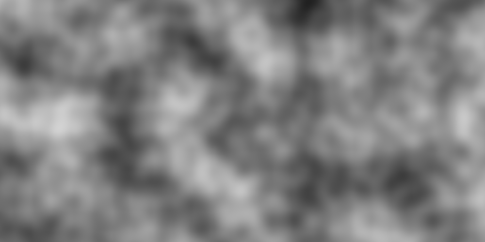
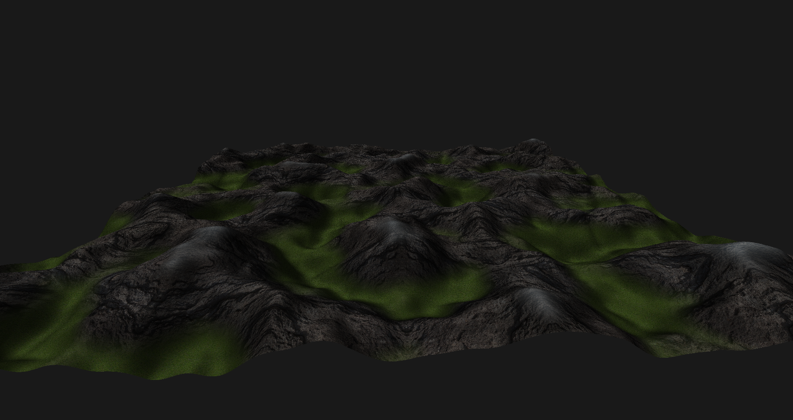

# Computer Animation Competition (Softwaredokumentation)

## Kontext

Die nachfolgende Softwaredokumentation beschreibt ein Projekt, das während der "Computer Animation Competition" des von Prof. Dr. Hullin gehaltenen Moduls "Einführung in die Computergraphik und Visualisierung" an der Rheinischen Friedrich-Wilhelms-Universität Bonn im Sommersemester 2019 durchgeführt wurde. Im Rahmen der "Computer Animation Competition" sollen in kleinen Teams kurze Animationen auf der Basis eines zuvor in Übungen erweiterten OpenGL-Frameworks erdacht, konzipiert und erstellt werden unter der Zuhilfenahme von Quellen aus dem Gebiet der Computergraphik.

## Beitragende

- Patrick Hähn [@haehnpt](https://github.com/haehnpt)
- Sebastian Kühn [@SekanderBast](https://github.com/SekanderBast)
- Volker Sobek [@IMFTC](https://github.com/IMFTC)

## Künstlerisches und technisches Konzept

### Künstlerisches Konzept

#### Story 

"Es erwächst ein Gebirge aus einer flachen Fläche. Dann erscheint über einen Zeitraum verteilt eine große
Anzahl von Kugeln im Himmel. Die Kugeln stürzen herunter und landen auf den Gebirgszügen, wodurch sie wiederum auf- und abspringen. Die Landschaft kippt in verschiedene Richtungen und sorgt somit für ein stärkeres Herumspringen der Kugeln. Nach einer gewissen Zeit tritt ein Ruhezustand ein - daraufhin stürzt die Landschaft nach unten ab, wobei die restliche Kugeln hinfort geschleudert werden."

#### Überlegungen

Die Landschaft soll aus schneebedeckten Bergen, steinigen Hängen und Wiesen im Flachland bestehen. Es werden verschiedene Texturen verwendet.

(PHYSIK)

### Technisches Konzept

Die in der Story benötigte Umgebung, die bergige Landschaft, wird mit Hilfe von pseudo-zufälligem Noise prozedural erzeugt und durch das Anpassen der Geometrie an die Texturen verfeinert.

(PHYSIK)

(KAMERA EFFEKTE)

Die erzeugten Frames werden mit Hilfe eines Converter-Tools zu einem  Video der gewünschten Qualität zusammengefügt.

## Komponenten

Die nachfolgende Auflistung zeigt die ursprünglich geplanten Komponenten unseres Projektes sortiert in absteigender Priorität der Implementierung.

| Komponente|Verantwortlicher|Fertiggestellt|Ins Projekt integriert|
|:----------|:---------------|:-------------|:---------------------|
|Physikalische Simulation|Volker|:heavy_check_mark:|:heavy_check_mark:|
|Shadow Mapping|Volker|:x:|:x:|
|Prozedurale Geometrie|Patrick|:heavy_check_mark:|:heavy_check_mark:|
|Displacement Mapping|Patrick|:heavy_check_mark:|:heavy_check_mark:|
|Datengetriebene Materialmodelle|Patrick|:x:|:x:|
|Partikelsystem|Volker|:x:|:x:|
|Bewegungsunschärfe|Sebastian|:heavy_check_mark:|:heavy_check_mark:|
|Fokusunschärfe|Sebastian|:heavy_check_mark:|:heavy_check_mark:|
|HDR-Effekte|Sebastian|:heavy_check_mark:|:heavy_check_mark:|
|Volumetrische Einfachstreuung|Sebastian|:x:|:x:|
|Interaktivität|Alle|:x:|:x:|

## Arbeitsschritte und Teilergebnisse

### Noise Generation (Perlin Noise)



Die Noise Generation ist für die nachfolgende Terrain Generation essenziell. Wir haben uns für *Perlin Noise* [1] entschieden, da diese Methode für unsere Zwecke hinreichend ist und durch Überlagerung von verschiedenen Frequenzen anschauliche Height-Maps generiert werden können. Die Funktionalität wurde in der Klasse **perlin_noise** gekapselt, die ausschließlich innerhalb der nachfolgenden Terrain Generation verwendet wird.

Verantwortlich: Patrick Hähn

```cpp
class perlin_noise 
{
    // Private member properties
    float *** gradients;
    int gradients_count;
    float max_distance;
    float offset;
    float scaling;
    float gradient_grid_distance;

    // Private member functions
    void create_gradients();
    float dot_grid_gradient(int index_x, int index_y, float x, float y);
    float lerp(float high, float low, float weight);
    float fade(float x);

public:
    // Public constructor & destructor
    perlin_noise(int gradients_count, float grid_distance, float offset, float scaling);
    ~perlin_noise();

    // Public member functions
    float get_noise(float x, float y);
    void clear_gradients();
};
```

### Terrain Generation



Die Generierung der Terrains sowie dessen Visualisierung werden in einer Klasse **terrain** gekapselt, sodass nach deren Instanziierung lediglich die öffentliche Funktion **terrain::render()** in der Render-Loop aufgerufen werden muss. Bei der Generierung wird die Klasse *geometry* des Frameworks wiederverwendet, um das Terrain zu repräsentieren. Die Klasse bietet desweiteren eine Funktion **terrain::get_normal_at_pos()**, die für die physikalischen Berechnungen benötigt wird. Die Generierung des Terrains basiert auf der obigen eigenen Implementierung von **perlin_noise** und wurde inspiriert durch *Red Blob Games* [2]. Für das Terrain werden die unten aufgeführten Shader **terrain_shader.vert** und **terrain_shader.frag** verwendet.

Verantwortlich: Patrick Hähn

```cpp
class terrain
{
	// Private member properties
	int start_frame = 0;
	int current_frame = 0;
	int frame_loc;
	int max_frame_loc;
	geometry terra;
	int frames;
	float size;
	int resolution;
	float min_height = 0.0;
	float max_height = 1.0;
	float lowest_height = 0.0;
	float highest_height = 1.0;

	// Static private class properties
	static int terrainShaderProgram;
	static int stone_loc;
	static int grass_loc;
	static int snow_loc;
	static int view_mat_loc;
	static int proj_mat_loc;
	static int light_dir_loc;
	static int albedo_loc;
	static int roughness_loc;
	static int ref_index_loc;
	static int terr_model_loc;

	// Private member functions
	float * get_heights(float range, float rigidity);
	void build();
	void clamp_heights();
	void get_frame_locations(int shader_program);
	void set_frames(int start, int max);
	void reset_current_frame();
	void increase_current_frame(int increase = 1);

	// Static private class functions
	static void get_texture_locations(int shader_program);
	static void load_textures(std::string stone, std::string grass, std::string snow);
	static unsigned create_texture_rgba32f(int width, int height, float* data);
	static float* load_texture_data(std::string filename, int* width, int* height);
	static void set_texture_filter_mode(unsigned int texture, GLenum mode);
	static void set_texture_wrap_mode(unsigned int texture, GLenum mode);

public:
	// Public constructor & destructor
	terrain(float size, int resolution, int start_frame, int max_frame, std::string stone, std::string grass, std::string snow);
	~terrain();

	// Public member functions
	glm::vec3 * get_normal_at_pos(float x, float z);
	void render(camera * cam, glm::mat4 proj_matrix, glm::vec3 light_dir);
	void set_model_mat(glm::mat4 model_mat);


	// Public member proterties (physics needs access)
	float * heights;


	// Public static functions
	static void create_terrain_shaders();

};
```

Im Vertex-Shader **terrain_shader.vert** werden das Terrain-Profil zu einem gegebenen Zeitpunkt errechnet sowie ein Displacement Mapping anhand der vorliegenden Textur vorgenommen:
```glsl
void main()
{
	// GET (U,V) TEXTURE COORDINATES
	uv = vec2(color.x, color.y);

	// GET DELTA AND FRAME HEIGHT
	float delta = min(1.0, frame / max_frame);
	float actual_height = delta * position.y;

	// DECIDE TEXTURE ( & TEXTURE HEIGHT)
	actual_height += texture_height_offset(position);
	tex_height = vec2(actual_height,0.0);// > 0.3 ? vec2(1.0,0.0) : vec2(0.0,0.0);

	// LIGHT DIRECTION
	vec3 temp_normal = normalize((1.0 - delta) * vec3(0.0,1.0,0.0) + delta * normal);
    	interp_normal = normalize((transpose(inverse(view_mat * terr_model_mat)) * vec4(temp_normal, 0.0)).xyz);
    	interp_light_dir = normalize((view_mat * vec4(light_dir, 0.0)).xyz);

	// POSITION & DISPLACEMENT MAPPING
	float displacement_amplitude = 0.005;
	vec4 displacement;
	if (tex_height.x > 0.8) displacement = texture2D(snow_tex, uv);
	else if (tex_height.x > 0.5) displacement = texture2D(stone_tex, uv);
	else displacement = texture2D(grass_tex, uv);
	float displacement_scalar = ((displacement.r + displacement.g + displacement.b) / 3.0 / (0.5 / displacement_amplitude) - displacement_amplitude) * tex_height.x;

	vec4 displaced_position = vec4(position.x, delta * position.y, position.z, 1.0) + displacement_scalar * vec4(interp_normal, 0.0);
    	gl_Position = proj_mat * view_mat * terr_model_mat * displaced_position;

	// COLOR
	interp_color = vec4(1.0,1.0,1.0,1.0);
}
```

Im Fragment-Shader **terrain_shader.frag** werden die Beleuchtungsrechnung vorgenommen sowie höhenabhängig Texturen bzw. Kombinationen von Texturen zugewiesen:
```glsl
void main() 
{
    float diffuseTerm = cdot(interp_normal, interp_light_dir);
    diffuseTerm = orennayarTerm(diffuseTerm, interp_normal, interp_light_dir);
    diffuseTerm = max(diffuseTerm, 0.1);
    float specularTerm = cooktorranceTerm(interp_normal, interp_light_dir);

	vec4 diff;
	vec4 spec;

	if (tex_height.x > 0.8){
		diff = texture2D(snow_tex, uv);
	}
	else if (tex_height.x > 0.7){
		float weight = (tex_height.x - 0.7) * 10.0;
		diff =  weight * texture2D(snow_tex, uv) + (1.0 - weight) * texture2D(stone_tex, uv);
	}
	else if (tex_height.x > 0.5){
		diff = texture2D(stone_tex, uv);
	}
	else if (tex_height.x > 0.4){
		float weight = (tex_height.x - 0.4) * 10.0;
		diff =  weight * texture2D(stone_tex, uv) + (1.0 - weight) * texture2D(grass_tex, uv);
	}
	else{
		diff = texture2D(grass_tex, uv);
	}

	spec = diff + vec4(0.1,0.1,0.09,0.0);
	// spec = vec4(10.0,0.0,0.0,1.0);
	frag_color = vec4(vec3(clamp(diff * diffuseTerm + spec * specularTerm, 0.0, 1.0)), 1);
}
```

### Physikalische Simulation

(VOLKER)

### Kamera Effekte

(SEBASTIAN)

### Video Rendering

Das Rendering des Videos wurde mit Hilfe des unter *GNU-General-Public*-Lizenz veröffentlichten Tools *ffmpeg* [3] realisiert. Dazu wurde eine Wrapper-Klasse **ffmpeg_wrapper** erstellt, die den Workflow kapselt, sodass lediglich nach jedem Durchlauf der Renderloop der aktuelle Framebuffer mit der Funktion **ffmpeg_wrapper::save_frame()** an *ffmpeg* übergeben werden muss.

Verantwortlich: Patrick Hähn

```cpp
class ffmpeg_wrapper
{
    // Private member properties
	int width;
	int height;
	int frames;
	int frame_counter;
	FILE * ffmpeg;

public:
    // Public constructor & destructor
	ffmpeg_wrapper(int width, int height, int frames);
	~ffmpeg_wrapper();

    // Public member functions
	void save_frame();
	bool is_finished();
};
```

## Resultat


(IN HTML DOKUMENTATION GIF DURCH VIDEO ERSETZEN)

Mit den unten aufgeführten Einstellungen wurde das obige Resultat erreicht.

```cpp
// Global settings
//#define DEBUG
#define x64
#define RENDER_VIDEO
#define DO_FULLSCREEN

// Render size
#define RENDER_WIDTH 1920
#define RENDER_HEIGHT 1080
#define RENDER_FRAMES 1920
#define RENDER_FILENAME "vorschau.mp4"

// Window size
#define WINDOW_WIDTH 1920
#define WINDOW_HEIGHT 1080

// Visual settings
#define FOV 45.0f
#define NEAR_VALUE 0.1f
#define FAR_VALUE 100.0f
#define BACKGROUND_COLOR 0.2f, 0.2f, 0.2f, 1.0f

// Terrain settings
#define TERRAIN_SIZE 8.0f
#define TERRAIN_FRAMES 360
#if defined(x64) && !defined(DEBUG)
#define TERRAIN_RESOLUTION 1000
#else
#define TERRAIN_RESOLUTION 100
#endif

// Camera settings
#define CAMERA_PHI 0.25f
#define CAMERA_THETA -0.15f
#define CAMERA_DISTANCE 10.0f

// Light settings
#define LIGHT_PHI 0.0f
#define LIGHT_THETA 0.3f

// Texture settings
#if defined(DEBUG)
#define GRASS "grass.jpg"
#define STONE "mountain.jpg"
#define SNOW "snow.jpg"
#else
#define GRASS "grass_large.jpg"
#define STONE "mountain_large.jpg"
#define SNOW "snow_large.jpg"
#endif

// Physics settings
#define SECONDS_PER_FRAME (1.f / 60.f)
#define SPHERE_RADIUS 0.04f
#define X_N_SPHERES 50
#define Z_N_SPHERES 50
// #define RENDER_PHY_PLANE
#define SPHERES_DROP_HEIGHT 1.f
#define SPHERES_APPEARANCE_FRAME 560
#define SPHERES_RELEASE_FRAME 760

// Tilting and Dropping
#define ENABLE_PLANE_TILT_AND_DROP

// First Round of Tilts
#define PLANE_TILT_ANGULAR_VELOCITY 0.4f, 0.f, 0.f
#define PLANE_TILT_START_FRAME 920
#define PLANE_TILT_INTERVAL 80
#define PLANE_TILT_END_FRAME (920 + 4 * 80)

// Second Round of Tilts
#define PLANE_TILT_VERTICALLY_START_FRAME 1600
#define PLANE_TILT_VERTICALLY_INTERVAL 100
#define PLANE_TILT_VERTICALLY_PAUSE_UNTIL 1800
#define PLANE_TILT_VERTICALLY_END_FRAME 1900

// Drop
#define PLANE_DROP_START_FRAME PLANE_TILT_VERTICALLY_START_FRAME
#define PLANE_DROP_INITIAL_VELOCITY 0.f, -0.001f, 0.f
#define PLANE_DROP_FACTOR 1.05f
#define PLANE_DROP_END_FRAME_PREVENT_UNEXPECTED_BEHAVIOUR 2500

// Whether to render with effects
#define ENABLE_EFFECTS

// Miscellaneous
#ifndef M_PI
#define M_PI 3.14159265359
#endif
```

## Evaluation

_Is gud._

## Referenzen

- [1] "Perlin Noise", Wikipedia, https://en.wikipedia.org/wiki/Perlin_noise, abgerufen: 05.07.2019
- [2] "Making maps with noise functions", Red Blob Games, https://www.redblobgames.com/maps/terrain-from-noise/, abgerufen: 05.07.2019
- [3] "FFMPEG Video Converter", FFMPEG, https://ffmpeg.org/, abgerufen: 05.07.2019